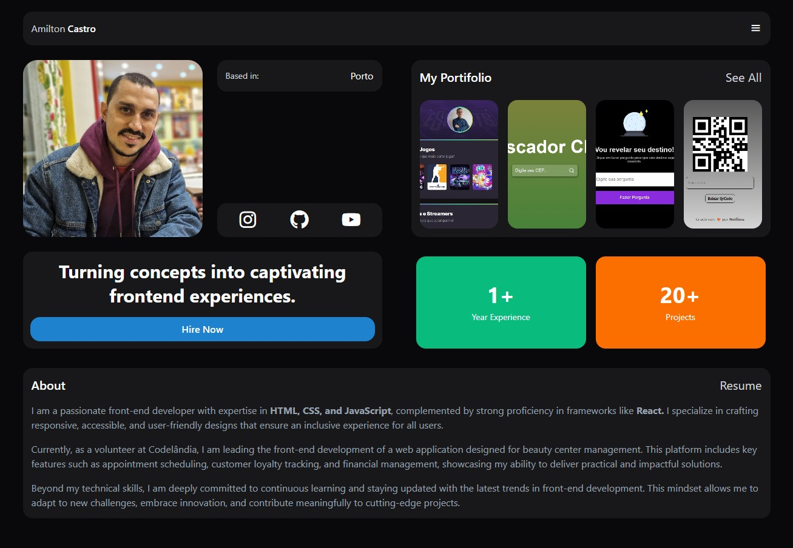

# Amilton Castro - Portfólio

Bem-vindo ao meu portfólio! Este projeto apresenta minha jornada como desenvolvedor front-end, destacando minhas habilidades, projetos e formas de contato.

## 🚀 Tecnologias Utilizadas

- **HTML5**
- **CSS3 (Tailwind CSS)**
- **JavaScript**
- **Boxicons** (ícones)

## 🎨 Estrutura do Projeto

- **Navegação**: Barra de navegação com nome e botão de menu.
- **Perfil**: Exibição de foto de perfil e informações básicas.
- **Seção de Informações**: Localização e redes sociais.
- **Seção Hero**: Mensagem principal e botão de contato.
- **Seção de Estatísticas**: Anos de experiência e número de projetos.
- **Portfólio**: Galeria com projetos desenvolvidos.
- **Sobre Mim**: Informações sobre minha experiência e atuação profissional.

## 📸 Captura de Tela



## 📂 Estrutura de Arquivos

```
├── public/
│   ├── build/tailwind.css
├── src/
│   ├── assets/
│   │   ├── Profile.jpg
│   │   ├── 1.png
│   │   ├── 2.png
│   │   ├── 3.png
│   │   ├── 4.png
│   ├── database/
│   ├── server.ts
├── index.html
```

## 🔗 Links

- [Meu GitHub](https://github.com/Notlima)
- [Meu LinkedIn](https://www.linkedin.com/in/amilton-castro/)
- [Meu Instagram](https://www.instagram.com/amiltonscj/)

## 🛠 Como Usar

1. Clone o repositório:
   ```sh
   git clone https://github.com/Notlima/Portfolio.git
   ```
2. Abra o arquivo `index.html` no navegador.

## 📧 Contato

Se deseja entrar em contato, clique no botão "Hire Now" ou envie um e-mail para:
[amiltonscjunior@gmail.com](mailto:amiltonscjunior@gmail.com)

---

Feito com 🧡 por **Notlima**

